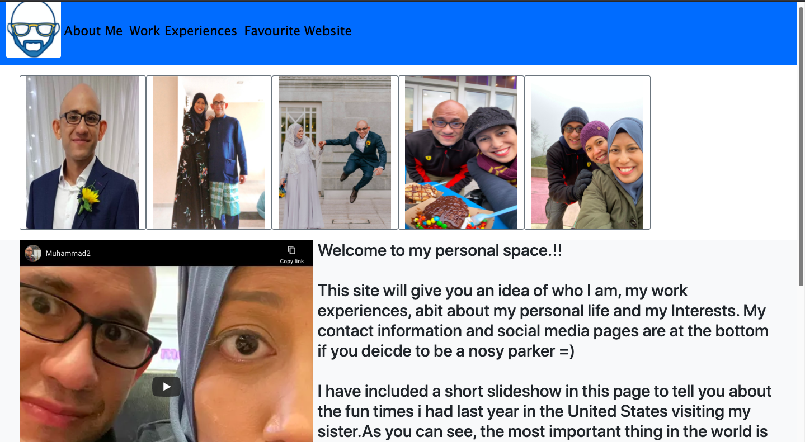

# Project-1-About-Muhammad
We were presented with a task to reflect what we have learned in the past 1 month on HTML and CSS.
I took the opportunity to create an on-line resume that will showcase my current and new skills to my potential employers. 
I decided to built an online-resume because It is something that I feel that I can build on after the course and further demonstrate my technical abilities as a programmer.
I decided to go for a simple, fresh and easy to navigate webpage so that the user can easily find out facts about myself. I chose a blue theme because blue is my favourite color

# demo link

Click <a href="https://muhammad-mo.github.io/Project-1-About-Muhammad/" target="blank">Here</a> to see a demo of the website.

# User Interface
The goal of the site is to enable the user to find out interesting and useful facts about me without any hassle

# Programming languages Used

1. HTML
2. CSS
3. Bootstrap 

# Features
The overall website's look is achieved as planned. 
Users are able to navigate to the different pages of the site and external links will open in a different tab
Users will be able to download a copy of the resume
A favcion was implemented for the icon to appear on the browser

# Features left to implement
A form for users to send in their details could be implented in the near future
Future coding projetcs can be uploaaded for potentiak employers to  access my coding skills

# Testing
All links were tested and brought the user to an externa page

The page was built with flexbox function in mind and works as intended

The page has a total of 4 seperate sections and the links work as intended

The youtubevideo played out accordingly

The Resume is downloadable

The website responded to different browser sizes

The code went through W3 validator

Users are able to fill in the form and the button is clickable

# Deployment

My site was deployed using Github's paltform via this link
[ https://muhammad-mo.github.io/Project-1-About-Muhammad/]

1)  In the deployed version, the cards under "My Favourite Website" did not appear in-line when
the page was deployed

2) Sosial Media icons "Twitter" and "Facebook" did not appear in the deployed pages

# Content
All content was authored by me

# Media
Pictures were taken from personal library
Website icons were taken from the respective websites
1) https://www.flaticon.com/
2)https://icons8.com/icons

Pictures in relation to "my favourite websites" were taken from the respective websites

# Credit
References and bootstrap codes were used from the following websites

1. https://www.stackoverflow.com
2. https://www.w3schools.com
3. https://www.w3.org/
4. https://getbootstrap.com/

I would like to thank the following people for contributing ideas and their guidance
during the tedious troubleshooting times

1.Ariff 
2.Malcolm 
3.Paul 
4.Shun 
5.Alex 
6.Classmates of batch 10 
7.Kelly (TGC)

