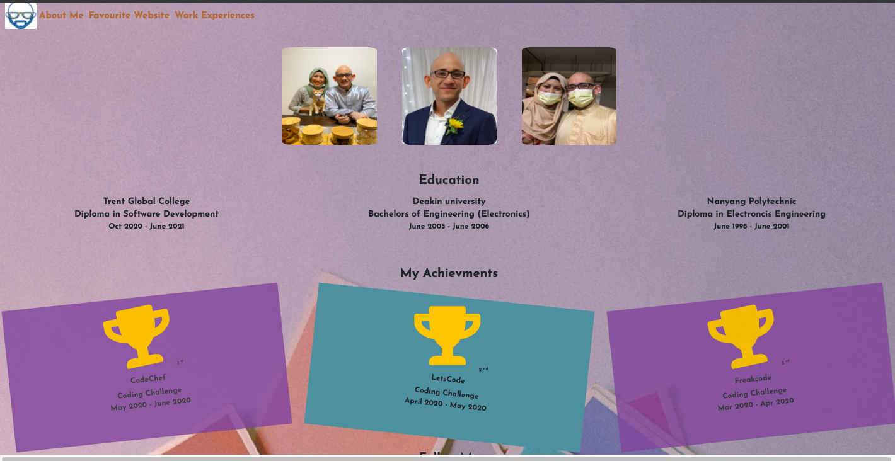
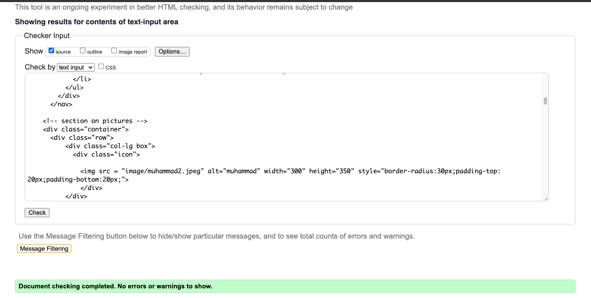
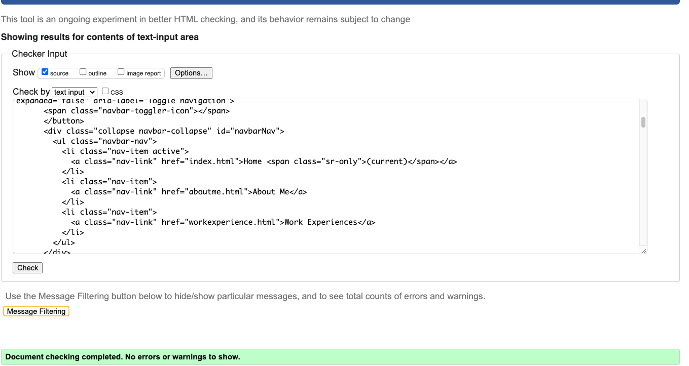
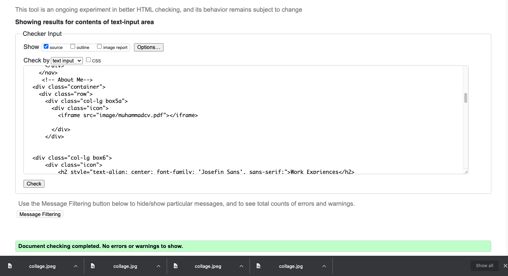
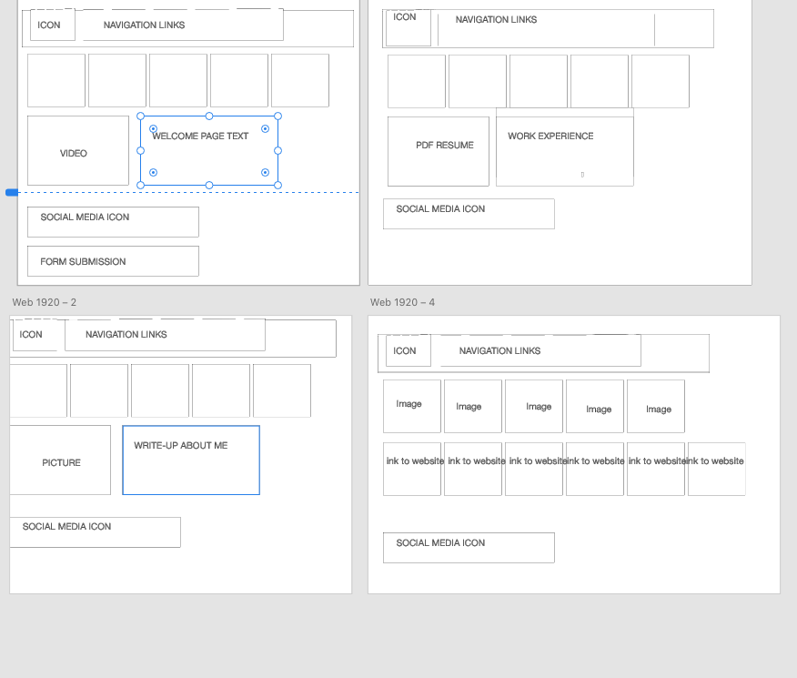

# Project-1-About-Muhammad
We were presented with a task to reflect what we have learned in the past 1 month on HTML and CSS.
I took the opportunity to create an on-line resume that will showcase my current and new skills to my potential employers. 
I decided to built an online-resume because It is something that I feel that I can build on after the course and further demonstrate my technical abilities as a programmer.
I decided to go for a simple, fresh and easy to navigate webpage so that the user can easily find out facts about myself, my work experience
and favourite websites. I chose a blue theme because blue is my favourite color.
Working on this website allows me to improve my knowledge on using HTML and CSS code aided with bootstrap.
Specifically this project allows me to deepend my knowledge on
1) Using boostrap to make responsive websites with the help of 'container'
2) Using bootstrap to make navigation links with hanburger toggler button when screen resizes
3) Attaching images
4) Attaching card type links
5) Positioning of text and images
6) Adjusting CSS styles to suit my website's design
7) RUnning code through validators encourages me to apply correct syntax
8) Applying padding and margin to text and images
9) Using bootstrap grid layout to position text and images

# demo link

Click <a href="https://muhammad-mo.github.io/Project-1-About-Muhammad/" target="blank">Here</a> to see a demo of the website.

# User Interface

The goal of the site is to enable the user to find out interesting and useful facts about me without any hassle.

# Programming languages Used

1. HTML
2. CSS
3. Bootstrap 

# Features

The overall website's look is achieved as planned. 
Users are able to navigate to the different pages of the site and external links will open in a different tab.
Users will be able to download a copy of the resume.
A favcion was implemented for the icon to appear on the browser.

# Features left to implement

Future coding projetcs can be uploaaded for potential employers to  access my coding skills.

# Testing
The code was put through the  W3 markup validator and the results are in the screenshot below

| Item Tested         | Result            |   Remarks                        |
| --------------------|:-----------------:|:-------------------------------  |
| Navbar-dropdown     | Works as intended | transforms into burger dropdown  |   
|Links                | Works as intended | User can navigate easily through the site       |       
|Resume Links         | Works as intended |Clicking on the resume brings user to a site where the resume can be downloaded|    
|Social Media Links   | Works as intended | Users can go to the different social media pages
| Responsivenes       | Works as intended | Works Well across mobile devices  | 
| Hover button        | Works as intended | the links change in color when a mouse is hovered above    |    |  
| Image inks          | Works as intended | Clicking on the image in "favourtie websites" brings the user to the desired webpge which opens up in a different window | 
| Icon button         | Works as intended | Clicking on the icon brings the user back to the homepage       |  

# Wireframe Design

The design and structure of the webpage was planned to be like this. 

The final product of the different webpages came out as intended displaying a
1) Welcome page
2) About me page
3) Experience page
4) Favourite website page

# Deployment

My site was deployed using Github's paltform via this link
[ https://muhammad-mo.github.io/Project-1-About-Muhammad/]

1)  In the deployed version, the cards under "My Favourite Website" did not appear in-line when
the page was deployed.

# Content

All content was authored by me.

# Media

Pictures were taken from a mixture of personal drive and websites
1) https://unsplash.com/
2) https://www.pexels.com/

Website icons were taken from the respective websites.
1) https://www.flaticon.com  
2) https://icons8.com/icons
3) https://fontawesome.com/
4
Pictures in relation to "my favourite websites" were taken from the respective websites.

# Credit

References and bootstrap codes were used from the following websites

1. https://www.stackoverflow.com
2. https://www.w3schools.com
3. https://www.w3.org/
4. https://getbootstrap.com/

I would like to thank the following people for contributing ideas and their guidance
during the tedious troubleshooting times.

1.Ariff 
2.Malcolm 
3.Paul 
4.Shun 
5.Alex 
6.Classmates of batch 10 
7.Kelly (TGC)

